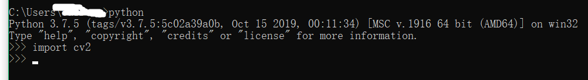

opencv+python+uiautomator2 滑动拼图验证码破解，滑动验证码破解，自我娱乐，仅供参考

## 使用

###### 准备：

第一步，python3.0及以上

第二步，安装OpenCV环境：

```
pip install numpy
```

下载OpenCV，下载地址：

https://opencv.org/releases.html

我用的是opencv-4.3.0-vc14_vc15.exe版本，双击安装，最好自定义目录，然后一直next到完成。

安装完成后，将 你安装的目录\opencv\build\python\2.7\x64目录下的cv2.pyd复制到 你安装的python目录\Lib\site-packages目录下。

完成之后，试试 import cv2，执行：

```
python
import cv2
```

结果如图：未见报错，说明配置成功



第三步，安装uiautomator2

```
pip install --pre uiautomator2
```

安装完成，将设备连到电脑上，adb devices 查看是否连接成功，连接成功后，执行init

```
python -m uiautomator2 init
```

此方法会在手机上安装一个ATX应用，用于交互使用。当successfully后，openatx提供了另外一个工具weditor工具

```
python -m weditor
```

会在默认浏览器上打开如图页面：


###### 运行脚本

脚本在code目录下，jigsawscript.py文件，直接双击运行或使用 python jigsawscript.py即可

###### 注：

代码内有注释，一看就明白。

###### 可能需要修改的地方：

1、滑块图片需要自己根据实际的滑块去截图，然后保存到同目录下，命名为2.png

2、根据抓取的滑块view的大小，确定template3的尺寸，不然尺寸不对，不能比对

3、根据抓取的滑块位置，确定模拟按下的坐标

##  效果


#### 原理
1、图形图像处理（图形比对）  
2、模拟手势

###### 第一步，截屏  


###### 第二步，找到滑块图形，裁剪（需提前完成）  


###### 第三步，图形比对  


**绿色框标记了比对结果**  

###### 第四步，计算比对图形位置  

###### 第五步，模拟手势，滑动滑块  


#### 实用，以网易易盾为例
网易易盾提供了在线体验功能  

###### 第一步，截屏  


###### 第二步，找到滑块图形，裁剪  


###### 第三步，图形比对  


**绿色框标记了比对结果，可以成功找到滑块位置**

###### 第四步，计算比对图形位置  

###### 第五步，模拟手势，滑动滑块 

#### 效果

