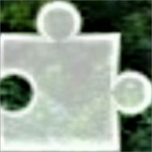
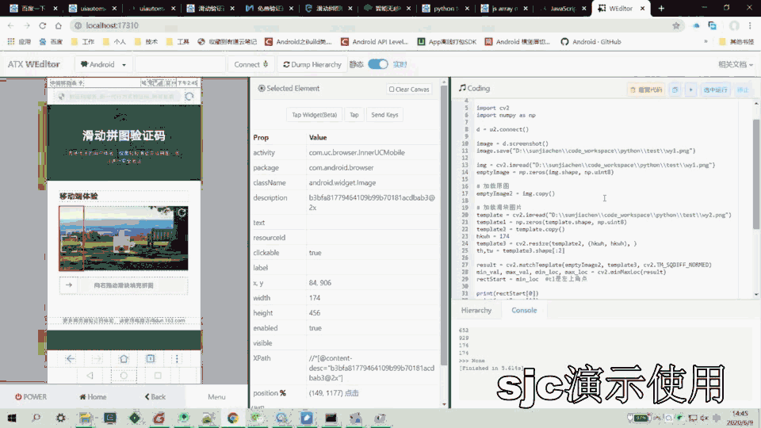

# 滑动拼图验证码破解
滑动拼图验证码破解，自我娱乐，仅供参考

#### 效果

#### 原理
1、图形图像处理（图形比对）  
2、模拟手势

##### 图形图像处理（图形比对）
第一步，截屏  

第二步，找到滑块图形，裁剪（需提前完成）  

第三步，图形比对  

==绿色框标记了比对结果==  
第四步，计算比对图形位置  
第五步，模拟手势，滑动滑块  

### 实用破解，以网易易盾为例
破解网易易盾提供了在线体验功能  

#### 开始破解  
第一步，截屏  

第二步，找到滑块图形，裁剪  

第三步，图形比对  

==绿色框标记了比对结果，可以成功找到滑块位置==  

第四步，计算比对图形位置  
第五步，模拟手势，滑动滑块 

#### 破解易盾滑动拼图验证码效果

